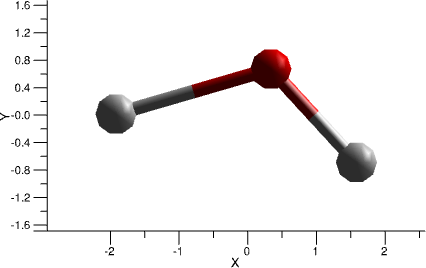

# Liquid Water

## 1. Create a Water Molecule

### Geometry

We'll create our water molecule species by drawing the atoms by hand.

> Species &#8680; Create... &#8680; Empty_
{: .action .action_menu}
> Choose "Draw mode" from the toolbar above the species viewer - 
{: .action .action_mouse}
> Change the drawing element from `C` to `O` by clicking on the button next to 
{: .step}
> Left-click somewhere in the viewer below to place an oxygen atom
{: .step}
> Change the drawing element to hydrogen
{: .step}
> Left-click-drag from the existing oxygen atom to draw a hydrogen bound to it
{: .step}
> Repeat for the other hydrogen
{: .step}

{: .img-centre}

You'll now have a water molecule that might look like its gone ten rounds with Mike Tyson, so let's clean it up. To achieve that we can apply a forcefield and do a quick geometry optimisation.

> Species &#8680; Add Forcefield Terms
{: .action .action_menu}
> From the available forcefields choose `SPC/Fw`
{: .step}
> Click through the remaining pages of the wizard to close it
{: .step}

Take a look at the _Contents & Forcefield_{: .text-green-100} section for the species and you'll see that we now have atom types assigned to our atoms, and suitable intramolecular terms assigned to the bonds and angle. When adding forcefield terms in this way the default action is for Dissolve to add global master terms for intramolecular interactions rather than assign them individually. Note that the functional forms of the interactions are actually the names of master terms, and are preceded with `@` to distinguish them as such.

We can now clean up the geometry of our molecule.

> Click the "medic" icon in the species viewer toolbar - 
{: .action .action_mouse}

Do this a couple of times until there's no further appreciable change to the geometry of the molecule.

### Isotopologues

Our eventual refinement will depend on three isotopic water samples - H2O, D2O, and a 50:50 mix of the two. The "Natural" (H2O) isotopologue is defined internally by Dissolve, so we just need to add a new one for D2O.

> **Species** tab, **Isotopologues** section
{: .action .action_mouse}
> Click _Add_{: .text-green-100}
{: .step}
> Expand the entries for the 'NewIsotopologue' by clicking the [+] next to its name, or by clicking _Expand All_{: .text-green-100}
{: .step}
> Change the isotope for the HW atom type from `Natural (bc = -3.739 fm)` to `2 (bc = 6.671)`
{: .step}
> Change the name of the isotopologue to 'D2O' (double-click on the name to do so)
{: .step}

[Back to Overview](index.md){: .btn }   [Next Step](step2.md){: .btn .right}
