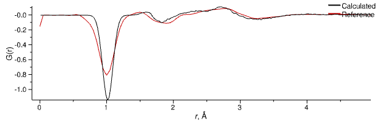
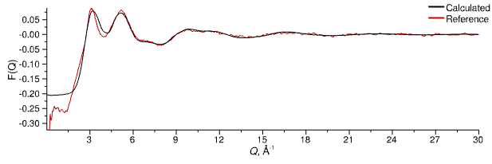

# Liquid Water

## 4. Equilibrate the System

We're now in a position to run our initial equilibration of the system, so set the simulation running and let the energy come down.

> **Evolve (Standard)** tab
{: .action .action_tabs}
> Double-click on the [`Energy`](/modules/energy) module to open its additional controls in a separate tab
{: .step}

Since we have our experimental reference data loaded, a further instructive quantity to check is the current agreement between simulation and experiment...

> **RDF / Neutron S(Q)** tab
{: .action .action_tabs}
> Double-click on the [`NeutronSQ (H2O)`](/modules/neutronsq) module to open its additional controls in a separate tab
{: .step}

Now we can see the comparison between the total neutron-weighted structure factor and radial distribution functions for the H2O sample. After a short while running you should see something looking like this:

{: .img-centre}
{: .img-centre}

At first glance the calculated and experimental F(Q) agree reasonably well, but the G(r) clearly show that we have a problem, with the feature for the O-H bond far too sharp and intense in the calculated data. This is less to do with inaccuracy of the intramolecular parameters present in the forcefield, and more to do with the apparent broadening of bound features caused by the relative speed of the probe particle to that of chemically-bound, vibrating atoms. To account for this difference we will apply an effective broadening function to the intramolecular g(r).

> **RDF / Neutron S(Q)** tab
{: .action .action_tabs}
> Double-click on the [`RDF`](/modules/rdf) module to open its additional controls in a separate tab
{: .step}
> Open the **Calculation** settings group
{: .action .action_settings}
> Set the **IntraBroadening** to `Gaussian` with a FWHM of 0.18 (the default)
{: .step}

Run the simulation for a few more steps until structure factor and radial distribution function settle, and you should get much better agreement.

{: .img-centre}
{: .img-centre}

[Previous Step](step3.md){: .btn }   [Next Step](step5.md){: .btn .right}
