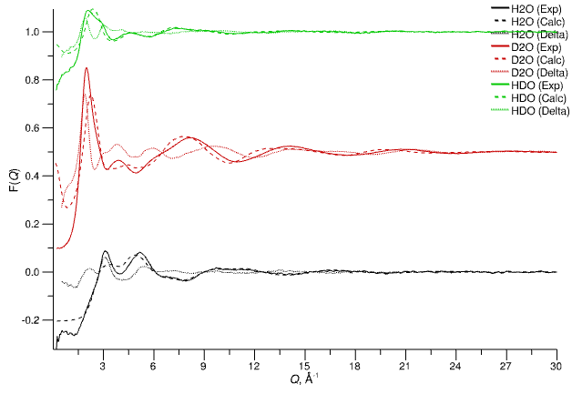

# Liquid Water

## 7. Set up Potential Refinement

Let's briefly recap what we've done so far:

1. Set up a liquid water system based on a literature forcefield (`SPC/Fw`)
2. Equilibrated the system and made an initial structural comparison with experimental data
2. Adjusted the intramolecular geometry of the water molecule in order to better match the experimental data

Our agreement with experiment is OK, but it is possible to make it even better by modifying the _inter_-atomic interaction parameters contained in the atom types. However, generally this is not to be attempted by hand in all but the simplest of cases, as the effects of adjusting the interatomic are seldom as obvious as those for _intra_-molecular parameters. Also, for even a modestly-complicated system the number of adjustable parameters is simply too large to tackle with manual fitting.

Here we'll employ the [`EPSR`](/userguide/modules/epsr) module in order to adjust the interatomic potentials automatically to give better agreement with the experimental reference data.

> Layer &#8680; Create... &#8680; Refinement... &#8680; Standard EPSR
{: .action .action_menu}

Our new layer contains only the [`EPSR`](/userguide/modules/epsr) module, and which Dissolve has set up with sensible targets and defaults. Double-click the [`EPSR`](/userguide/modules/epsr) module to open it up as a tab - we'll need to explore the various graphs as we proceed, but for now let's check the set-up of the module.

> **Refine (EPSR)** tab
{: .action .action_tabs}
> Open the **Calculation** settings group
{: .action .action_groups}
> An initial value for **EReq** has been set (3.0) - this determines the magnitude or "strength" of the generated interatomic potential
{: .step}
> The **Feedback** factor is 0.8 - this states that we are 80% confident in the experimental data, and that the calculated partial structure factors should make up 20% of the estimated partials.
{: .step}
> The range of data over which to generate the potential in _Q_-space is determined by **QMax** (30 &#8491;-1)and **QMin** (0.5 &#8491;-1)
{: .step}
> The experimental data to use in the refinement are set in the **Target** option, which lists all available modules by name that have suitable data for the [`EPSR`](/userguide/modules/epsr) module to use. All of the [`NeutronSQ`](/userguide/modules/neutronsq) modules have been selected automatically.
{: .step}

All of these default values are fine for our purpose, but before we start the refinement proper its worth going through the various quantities displayed in the  [`EPSR`](/userguide/modules/epsr) tab. We'll turn off refinement of the empirical potential for now, and start the simulation again to get some initial data in these graphs.

> **Refine (EPSR)** tab
{: .action .action_tabs}
> Open the **Calculation** settings group
{: .action .action_groups}
> Uncheck the **ModifyPotential** option
{: .step}
> Start the simulation running
{: .step}
> Double-click on the [`EPSR`](/userguide/modules/epsr) to open it up in a new tab
{: .step}

Now let's go through the different plots in the [`EPSR`](/userguide/modules/epsr) module one by one.

### 1. F(Q)

A broad overview of the agreement between 

{: .img-centre}
*Equilibrated water (D2O) G(r) with effective broadening applied to intramolecular g(r)*

[Previous Step](step6.md){: .btn }   [Next Step](step8.md){: .btn .right}
